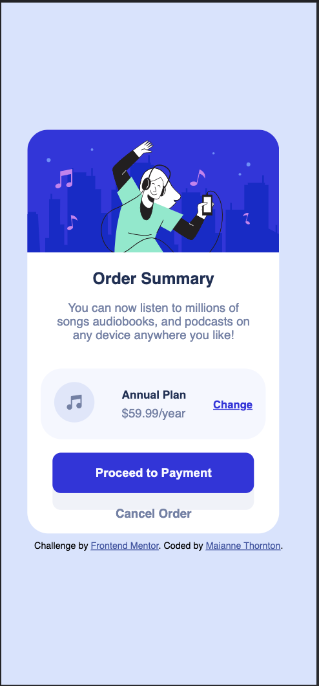

# Frontend Mentor - Order summary card solution

This is a solution to the [Order summary card challenge on Frontend Mentor](https://www.frontendmentor.io/challenges/order-summary-component-QlPmajDUj). Frontend Mentor challenges help you improve your coding skills by building realistic projects.

## Table of contents 😌

- [Overview](#overview)
  - [The challenge](#the-challenge)
  - [Screenshot](#screenshot)
  - [Links](#links)
- [My process](#my-process)
  - [Built with](#built-with)
  - [What I learned](#what-i-learned)
  - [Continued development](#continued-development)
  - [Useful resources](#useful-resources)
- [Author](#author)
- [Acknowledgments](#acknowledgments)

## Overview 👋🏾

Welcome to my second Frontend Mentor Challenge!

### The challenge 😥

Users should be able to:

- View the optimal layout depending on their device's screen size
- See hover states for interactive elements

### Screenshot 🌇



### Links 👩🏾‍💻

- Solution URL: (https://github.com/MaianneThornton/OrderSummaryComponent)
- Live Site URL: (https://fm-ordersummarycomponent.netlify.app/)

## My process 💭

I started by consulting the style guide, and created a separate stylesheet. Then I marked out initial classes in the html file to be later used for styling. I also added images and icons during this step. Next I began styling the css using the mobile first design method. I styled from top to bottom, accessing each class I previously created. I then styled the desktop media query. Lastly, I added the active styles so that the card is responsive.

### Built with 👷🏾‍♀️

- Semantic HTML5 markup
- CSS custom properties
- Flexbox
- Mobile-first workflow

### What I learned 👩🏾‍🏫

I learned how to create border shadows which was really interesting. See code snippet below:

```css
.btn {
  box-shadow: 0px 20px hsl(228, 45%, 96%);
}
```

I also got to practice positioning, and sizing and selectors. See code snippet below:

```css
.card_footer .link_undecorated:hover {
  color: hsl(223, 47%, 23%);
}
```

I continued to utilize the conventions previously learned while writing git commit messages. This is a very useful skill, it allows the reader to get a better idea as to what changes were made and why.

I also continued working on naming my classes more efficiently. I believe that this work has not been in vain, as I found it much easier this time to decide what to name classes for styling.

### Continued development 🔮

In the future I plan on continuing to practice positioning elements as well as learning more effects like the active styles I used during this exercise.

I also plan on continuing to learn the best ways to phrase git commits, so that future viewers can fully understand the changes that have occurred.

### Useful resources 📖

- [Resource 1](https://developer.mozilla.org/en-US/docs/Web/CSS/box-shadow) - This helped me learn how to create box-shadows. This site spelled out the process very cleanly and I appreciate that.
- [Resource 2](https://gist.github.com/basham/2175a16ab7c60ce8e001) - This helped me determine the best css units to choose per media type. This also cleanly displays relative units and their descriptions.
- [Resource 3](https://www.freecodecamp.org/news/how-to-write-better-git-commit-messages/) - This is an amazing article which helped me write better commit messages. I'd recommend it to anyone still learning this concept.
- [Resource 4](https://9elements.com/bem-cheat-sheet/) - This is an amazing article which helped me write class names and better organize my code. I'd recommend it to everyone learning this concept.

## Author 🔎

- Website - [Maianne Thornton](https://www.maiannethornton.com/)
- Frontend Mentor - [@MaianneThornton](https://www.frontendmentor.io/profile/MaianneThornton)
- GitHub - [@MaianneThornton](GitHub.com/MaianneThornton)
- Twitter - [@MaianneThornton](https://twitter.com/MaianneThornton)
- LinkedIn - [@MaianneThornton](https://www.linkedin.com/in/maiannethornton/)

## Acknowledgments 🙏🏾

Special Thanks go to [@sazzledazzle](https://www.frontendmentor.io/profile/sazzledazzle), [@ohmymario](https://www.frontendmentor.io/profile/ohmymario) and [@darryncodes](https://www.frontendmentor.io/profile/darryncodes) for their expertise and assistance in fine-tuning my code.
